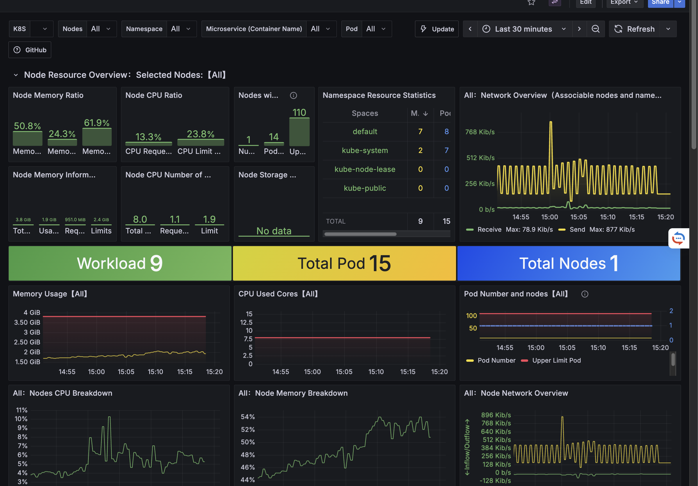
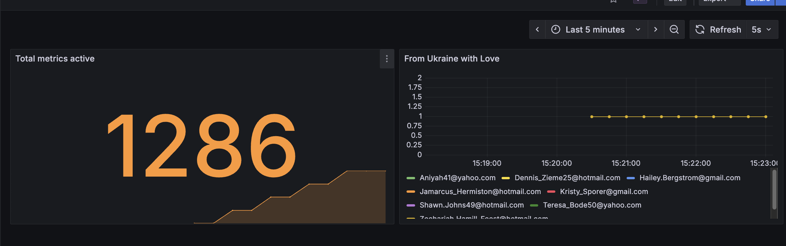

# test-spam2000

## spam3000 Implementation

The spam3000 implementation is an enhanced version of spam2000, with monitoring and dashboards

### About
To get started, run the following command to install Minikube for macOS using Homebrew:

```bash
make all
```

It will install minikube and deploy helm chart locally.

### Dashboard Examples

Here are examples of the dashboards available in spam3000:





Additionally, you can run tests and deploy to Minikube in GitHub Actions, which simulates a remote deployment using Helm.